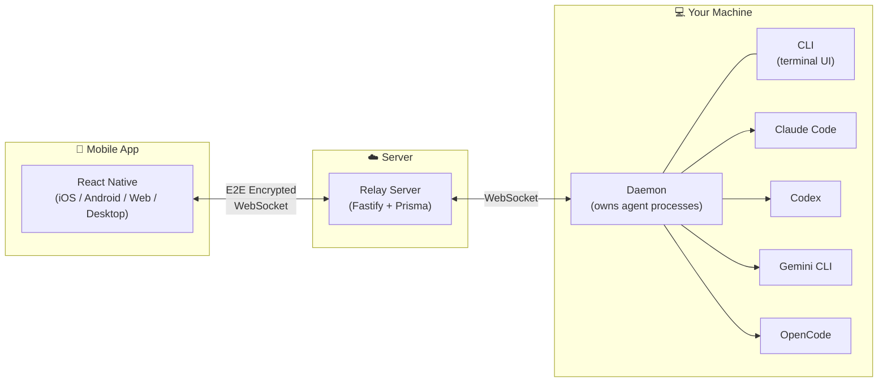

<p align="center">
  <a href="README.md">English</a> | <a href="README.zh-CN.md">简体中文</a>
</p>

<p align="center">
  <h1 align="center">AgentBridge</h1>
  <p align="center">
    <strong>Remote Control Platform for AI Coding Agents</strong>
  </p>
  <p align="center">
    Control Claude Code, Codex, Gemini, and OpenCode from anywhere.<br/>
    Monitor progress, handle permissions, manage sessions — from mobile or desktop.
  </p>
  <p align="center">
    <a href="https://opensource.org/licenses/MIT"></a>
    <a href="https://www.npmjs.com/package/@saaskit-dev/free"></a>
    <a href="https://nodejs.org/"></a>
    <a href="https://www.typescriptlang.org/"></a>
  </p>
</p>

---

## Why AgentBridge?

AI coding agents like Claude Code and Codex are powerful — but they run in a terminal on your machine. When you step away, you lose visibility. Permission requests go unanswered. Sessions hang.

**AgentBridge fixes this.** It wraps your AI agents in a daemon process and syncs everything to your phone in real-time with end-to-end encryption. Your code never leaves your machine unencrypted.

**Key capabilities:**

- **Multi-Agent** — One unified interface for Claude Code, OpenAI Codex, Google Gemini CLI, and OpenCode
- **Remote Control** — Monitor progress, approve/deny permissions, send prompts from your phone
- **Background Daemon** — Agents keep running even when your terminal closes or SSH disconnects
- **End-to-End Encryption** — X25519 key exchange + AES-256-GCM; your code stays private
- **Session Persistence** — Resume sessions across devices and restarts
- **Real-Time Sync** — WebSocket-based with sub-second latency

## Architecture



The daemon owns all agent processes — if your CLI crashes or you close the terminal, the agent keeps running. Reconnect anytime from the CLI or the mobile app.

## Quick Start

### Install CLI

```bash
npm install -g @saaskit-dev/free
```

Or use the install script (builds from source + installs daemon service):

```bash
curl -fsSL https://raw.githubusercontent.com/saaskit-dev/agentbridge/main/install.sh | bash
```

### Start a Session

```bash
free                    # Claude Code (default)
free gemini             # Gemini CLI
free codex              # OpenAI Codex
free opencode           # OpenCode
```

A QR code appears on launch — scan it with the mobile app to connect.

### Authenticate

```bash
free auth               # Account authentication
free connect gemini     # Link Google account
free connect claude     # Link Anthropic account
free connect codex      # Link OpenAI account
free connect status     # View all connection status
```

### CLI Options

```bash
free --claude-env KEY=VALUE       # Pass env vars to Claude Code
free --no-sandbox                 # Disable sandbox
```

> Unknown flags are passed through to the underlying agent CLI. For example, `free -m sonnet -p auto` forwards `-m sonnet -p auto` directly to Claude Code.

### Daemon Management

```bash
free daemon start       # Start background daemon
free daemon stop        # Stop daemon
free daemon status      # Check status
free doctor             # System diagnostics
```

## Project Structure

This is a pnpm monorepo with four packages:

```
agentbridge/
├── packages/
│   └── core/                 # @saaskit-dev/agentbridge — shared SDK
│       ├── types/            #   Type definitions (session, message, agent, ...)
│       ├── interfaces/       #   Abstract contracts (ICrypto, IStorage, IAgentBackend, ...)
│       ├── implementations/  #   Platform implementations (ACP backends, transports)
│       ├── encryption/       #   E2E encryption (SecretBox, AES-256-GCM, wire encoding)
│       ├── telemetry/        #   Structured logging with trace correlation
│       └── utils/            #   Encoding, async primitives, tmux, etc.
│
└── apps/free/
    ├── cli/                  # @saaskit-dev/free — CLI & Daemon
    │   ├── daemon/           #   Background process (SessionManager, IPC, AgentBackends)
    │   ├── backends/         #   Claude/Gemini/Codex/OpenCode backend implementations
    │   ├── client/           #   CLI renderer & input handler
    │   └── api/              #   Server communication & encryption
    │
    ├── server/               # Relay server (Fastify + Prisma)
    │   ├── api/              #   REST routes, WebSocket handlers, RPC
    │   ├── auth/             #   Challenge-response authentication
    │   └── storage/          #   Database abstraction (PostgreSQL / PGlite)
    │
    └── app/                  # Mobile/Desktop client (React Native / Expo / Tauri)
        ├── app/(app)/        #   Page components (Expo Router)
        ├── components/       #   UI components (messages, tools, markdown, ...)
        ├── sync/             #   State management, encryption, WebSocket
        └── realtime/         #   Voice assistant & WebRTC
```

### Desktop App

The desktop app reuses the Expo web frontend and packages it with Tauri:

```bash
cd apps/free/app
pnpm tauri:dev
pnpm tauri:build:production
```

## Self-Hosted Deployment

The relay server can be fully self-hosted. It ships with an embedded database (PGlite) — no external PostgreSQL needed:

```bash
./run build server                                    # Build Docker image
docker run -d -p 3000:3000 \
  -e FREE_MASTER_SECRET=your-secret-key \
  -v free-data:/app/data \
  kilingzhang/free-server:latest
```

Then point your CLI:

```bash
FREE_SERVER_URL=https://your-server.example.com free
```

See **[apps/free/server/README.md](apps/free/server/README.md)** for the complete deployment guide (Docker Compose, external PostgreSQL, Nginx reverse proxy, logs, etc.).

## Core SDK

The `@saaskit-dev/agentbridge` package provides platform-agnostic building blocks:

```bash
npm install @saaskit-dev/agentbridge
```

| Import Path                           | Use Case                                     |
| ------------------------------------- | -------------------------------------------- |
| `@saaskit-dev/agentbridge`            | Full SDK (Node.js)                           |
| `@saaskit-dev/agentbridge/common`     | React Native / Browser (no `node:*` imports) |
| `@saaskit-dev/agentbridge/types`      | Pure type definitions                        |
| `@saaskit-dev/agentbridge/encryption` | Encryption primitives                        |
| `@saaskit-dev/agentbridge/telemetry`  | Structured logging                           |

Key interfaces:

- **`IAgentBackend`** — Unified agent control (`startSession`, `sendPrompt`, `cancel`, `onMessage`)
- **`ITransportHandler`** — Agent-specific ACP protocol behaviors
- **`ICrypto`** — TweetNaCl + AES-256-GCM encryption
- **`IStorage`** — Key-value storage abstraction

All interfaces use a **factory pattern** for dependency injection:

```typescript
import { registerCryptoFactory, createCrypto } from '@saaskit-dev/agentbridge';

registerCryptoFactory(() => new NodeCrypto());
const crypto = createCrypto();
```

See [`packages/core/README.md`](packages/core/README.md) for full API documentation.

## Security

| Layer                    | Mechanism                               |
| ------------------------ | --------------------------------------- |
| **Key Exchange**         | X25519 (Curve25519 Diffie-Hellman)      |
| **Symmetric Encryption** | AES-256-GCM                             |
| **Authentication**       | Ed25519 signatures + challenge-response |
| **Transport**            | TLS + E2E encryption (double encrypted) |
| **Storage**              | Private keys stored with `chmod 0600`   |

- All data is encrypted on-device before leaving your machine
- The relay server never sees plaintext — it forwards encrypted blobs
- Each session uses unique encryption keys
- Challenge-response auth prevents replay attacks

## Development

### Prerequisites

- Node.js >= 20
- pnpm >= 8

### Full Dev Environment

All workflows are managed through the `./run` script:

```bash
git clone https://github.com/saaskit-dev/agentbridge.git
cd agentbridge
pnpm install

# One-command setup: builds core + CLI, starts server + daemon + desktop
./run dev

# Or start individual services:
./run dev server            # Server + daemon only
./run dev web               # Web app only
./run dev quick             # Skip build, fast restart
./run desktop               # Desktop app (Tauri dev)
```

### Testing

```bash
./run test unit             # Unit tests (Vitest)
./run test                  # E2E tests (Playwright)
./run test lifecycle        # Message lifecycle integration tests
```

### Mobile Development

```bash
./run ios                   # iOS debug (connects to Metro)
./run android               # Android debug (connects to Metro)
./run ios release           # iOS release (production server, embedded bundle)
./run android release       # Android release (production server, embedded bundle)
```

### Desktop Development

```bash
./run desktop               # Desktop debug (Tauri + Expo Web)
./run desktop build         # Build desktop production app
./run desktop build-dev     # Build desktop development app
```

### Build & Publish

```bash
./run build core            # Build core SDK
./run build cli             # Build CLI + npm link
./run build server          # Build server Docker image
./run npm publish           # Publish to npmjs.org
```

## Environment Variables

| Variable                  | Description                    | Default                           |
| ------------------------- | ------------------------------ | --------------------------------- |
| `FREE_SERVER_URL`         | Backend server URL             | `https://free-server.saaskit.app` |
| `FREE_HOME_DIR`           | Data directory                 | `~/.free`                         |
| `FREE_DISABLE_CAFFEINATE` | Disable macOS sleep prevention | `false`                           |

## System Requirements

| Agent       | Requirement                                            |
| ----------- | ------------------------------------------------------ |
| Claude Code | `claude` CLI installed and authenticated               |
| Gemini      | `gemini` CLI installed (`npm i -g @google/gemini-cli`) |
| Codex       | `codex` CLI installed                                  |
| OpenCode    | `opencode` CLI installed                               |

## Contributing

Contributions are welcome! Here's how to get started:

1. Fork the repository
2. Create a feature branch: `git checkout -b feature/my-feature`
3. Make your changes
4. Run tests: `./run test unit`
5. Verify no circular dependencies: `npx madge --circular --extensions ts,tsx packages/ apps/`
6. Commit: `git commit -m 'feat: add my feature'`
7. Push and open a Pull Request

### Code Conventions

- **No circular dependencies** — verified with madge
- **Strict TypeScript** — no untyped code
- **Logger over console.log** — all debug logging via `@agentbridge/core/telemetry`
- **Named exports** preferred
- **Tests colocated** with source files (`.test.ts`)

## Uninstall

```bash
curl -fsSL https://raw.githubusercontent.com/saaskit-dev/agentbridge/main/uninstall.sh | bash
```

## Roadmap

- [ ] Web dashboard for session management
- [ ] Multiple concurrent sessions per machine
- [ ] Custom MCP server configuration via mobile UI
- [ ] Team collaboration features
- [ ] Apple Watch companion app

## License

[MIT](LICENSE)

## Acknowledgments

- [Anthropic](https://anthropic.com) — Claude Code
- [OpenAI](https://openai.com) — Codex
- [Google](https://ai.google.dev) — Gemini CLI
- [OpenCode](https://github.com/opencode-ai/opencode) — OpenCode
