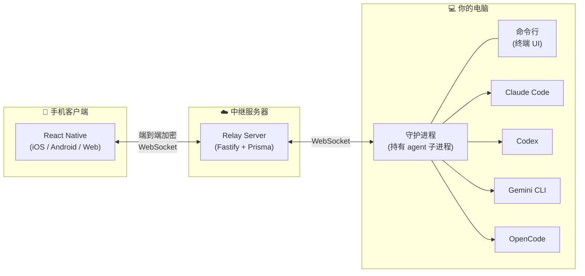

<p align="center">
  <a href="README.md">English</a> | <a href="README.zh-CN.md">简体中文</a>
</p>

<p align="center">
  <h1 align="center">AgentBridge</h1>
  <p align="center">
    <strong>AI 编程助手远程控制平台</strong>
  </p>
  <p align="center">
    随时随地控制 Claude Code、Codex、Gemini 和 OpenCode。<br/>
    用手机监控进度、处理权限请求、管理多个 AI 会话。
  </p>
  <p align="center">
    <a href="https://opensource.org/licenses/MIT"></a>
    <a href="https://www.npmjs.com/package/@saaskit-dev/free"></a>
    <a href="https://nodejs.org/"></a>
    <a href="https://www.typescriptlang.org/"></a>
  </p>
</p>

---

> 重构说明：本 README 主要描述产品和当前实现形态。在 `headless-runtime`
> worktree 中，架构设计以 `docs/rfc/013-headless-runtime-architecture.md` 为准。

## 为什么需要 AgentBridge？

Claude Code、Codex 这些 AI 编程助手功能很强 —— 但它们跑在你的终端里。一旦你离开电脑，就看不到进度了。权限请求没人批准，会话就卡在那里。

**AgentBridge 解决这个问题。** 它把 AI agent 包装在常驻后台进程中，通过端到端加密将所有信息实时同步到你的手机。你的代码在离开本机之前就已加密，隐私有保障。

**核心能力：**

- **多 Agent 统一管理** — 一个界面控制 Claude Code、OpenAI Codex、Google Gemini CLI 和 OpenCode
- **远程控制** — 在手机上监控进度、批准/拒绝权限、发送提示词
- **后台守护进程** — 关掉终端甚至 SSH 断线，agent 照样运行
- **端到端加密** — X25519 密钥交换 + AES-256-GCM 对称加密，代码隐私无忧
- **会话持久化** — 跨设备、跨重启无缝恢复会话
- **实时同步** — 基于 WebSocket，亚秒级延迟

## 架构



守护进程持有所有 agent 子进程 —— 即使 CLI 崩溃或终端关闭，agent 仍然继续运行。随时通过命令行或手机重新连接。

## 快速开始

### 安装 CLI

```bash
npm install -g @saaskit-dev/free
```

或使用一行脚本安装（自动构建源码 + 安装守护进程）：

```bash
curl -fsSL https://raw.githubusercontent.com/saaskit-dev/agentbridge/main/install.sh | bash
```

### 启动会话

```bash
free                    # Claude Code（默认）
free gemini             # Gemini CLI
free codex              # OpenAI Codex
free opencode           # OpenCode
```

启动后会显示二维码 —— 用手机 App 扫描即可连接。

### 身份认证

```bash
free auth               # 账号认证
free connect gemini     # 关联 Google 账号
free connect claude     # 关联 Anthropic 账号
free connect codex      # 关联 OpenAI 账号
free connect status     # 查看所有连接状态
```

### CLI 选项

```bash
free --claude-env KEY=VALUE       # 传递环境变量给 Claude Code
free --no-sandbox                 # 禁用沙箱
```

> 未识别的参数会直接透传给底层 agent CLI。例如 `free -m sonnet -p auto` 会将 `-m sonnet -p auto` 转发给 Claude Code。

### 守护进程管理

```bash
free daemon start       # 启动守护进程
free daemon stop        # 停止守护进程
free daemon status      # 查看状态
free doctor             # 系统诊断
```

## 项目结构

这是一个 pnpm monorepo，包含四个模块：

```
agentbridge/
├── packages/
│   └── core/                 # @saaskit-dev/agentbridge — 共享 SDK
│       ├── types/            #   类型定义（session, message, agent, ...）
│       ├── interfaces/       #   接口契约（ICrypto, IStorage, IAgentBackend, ...）
│       ├── implementations/  #   平台实现（ACP 后端、传输层）
│       ├── encryption/       #   端到端加密（SecretBox, AES-256-GCM, wire 编码）
│       ├── telemetry/        #   结构化日志与 trace 关联
│       └── utils/            #   编解码、异步原语、tmux 等工具
│
└── apps/free/
    ├── cli/                  # @saaskit-dev/free — CLI & 守护进程
    │   ├── daemon/           #   后台进程（SessionManager, IPC, AgentBackend）
    │   ├── backends/         #   Claude/Gemini/Codex/OpenCode 后端实现
    │   ├── client/           #   CLI 渲染器和输入处理
    │   └── api/              #   与服务器通信 & 加密
    │
    ├── server/               # 中继服务器（Fastify + Prisma）
    │   ├── api/              #   REST 路由、WebSocket 处理、RPC
    │   ├── auth/             #   挑战-响应认证
    │   └── storage/          #   数据库抽象（PostgreSQL / PGlite）
    │
    └── app/                  # 手机客户端（React Native / Expo）
        ├── app/(app)/        #   页面组件（Expo Router）
        ├── components/       #   UI 组件（消息、工具、Markdown 等）
        ├── sync/             #   状态管理、加密、WebSocket
        └── realtime/         #   语音助手 & WebRTC
```

## 自托管部署

中继服务器支持完全自托管，内置嵌入式数据库（PGlite）—— 无需外部 PostgreSQL：

```bash
./run build server                                    # 构建 Docker 镜像
docker run -d -p 3000:3000 \
  -e FREE_MASTER_SECRET=your-secret-key \
  -v free-data:/app/data \
  kilingzhang/free-server:latest
```

然后将 CLI 指向你的服务器：

```bash
FREE_SERVER_URL=https://your-server.example.com free
```

完整部署指南请参考 **[apps/free/server/README.md](apps/free/server/README.md)**（Docker Compose、外部 PostgreSQL、Nginx 反向代理、日志查询等）。

## 核心 SDK

`@saaskit-dev/agentbridge` 包提供跨平台的底层构建模块：

```bash
npm install @saaskit-dev/agentbridge
```

| 导入路径                              | 适用场景                                  |
| ------------------------------------- | ----------------------------------------- |
| `@saaskit-dev/agentbridge`            | 完整 SDK（Node.js）                       |
| `@saaskit-dev/agentbridge/common`     | React Native / 浏览器（无 `node:*` 导入） |
| `@saaskit-dev/agentbridge/types`      | 纯类型定义                                |
| `@saaskit-dev/agentbridge/encryption` | 加密原语                                  |
| `@saaskit-dev/agentbridge/telemetry`  | 结构化日志                                |

核心接口：

- **`IAgentBackend`** — 统一 agent 控制（`startSession`、`sendPrompt`、`cancel`、`onMessage`）
- **`ITransportHandler`** — Agent 专属的 ACP 协议行为
- **`ICrypto`** — TweetNaCl + AES-256-GCM 加密
- **`IStorage`** — 键值存储抽象

所有接口采用 **工厂模式** 实现依赖反转：

```typescript
import { registerCryptoFactory, createCrypto } from '@saaskit-dev/agentbridge';

registerCryptoFactory(() => new NodeCrypto());
const crypto = createCrypto();
```

完整 API 文档见 [`packages/core/README.md`](packages/core/README.md)。

## 安全性

| 层级         | 机制                                |
| ------------ | ----------------------------------- |
| **密钥交换** | X25519（Curve25519 Diffie-Hellman） |
| **对称加密** | AES-256-GCM                         |
| **身份认证** | Ed25519 签名 + 挑战-响应            |
| **传输安全** | TLS + 端到端加密（双重加密）        |
| **密钥存储** | 私钥文件权限 `chmod 0600`           |

- 所有数据在离开你的电脑之前就已加密
- 中继服务器看不到任何明文 —— 它只转发加密数据
- 每个会话使用独立的加密密钥
- 挑战-响应认证防止重放攻击

## 开发指南

### 前置条件

- Node.js >= 20
- pnpm >= 8

### 完整开发环境

所有工作流通过 `./run` 脚本统一管理：

```bash
git clone https://github.com/saaskit-dev/agentbridge.git
cd agentbridge
pnpm install

# 一键启动：构建 core + CLI、启动 server + daemon + web
./run dev

# 或单独启动某个服务：
./run dev server            # 只启动后端 + daemon
./run dev web               # 只启动 Web 应用
./run dev quick             # 跳过构建，快速重启
```

### 测试

```bash
./run test unit             # 单元测试（Vitest）
./run test                  # E2E 测试（Playwright）
./run test lifecycle        # 消息全链路集成测试
```

### 移动端开发

```bash
./run ios                   # iOS 调试（连 Metro）
./run android               # Android 调试（连 Metro）
./run ios release           # iOS 发布（连生产服务器，嵌入 bundle）
./run android release       # Android 发布（连生产服务器，嵌入 bundle）
```

### 构建 & 发包

```bash
./run build core            # 构建 Core SDK
./run build cli             # 构建 CLI + npm link
./run build server          # 构建 Server Docker 镜像
./run npm publish           # 发布到 npmjs.org
```

## 环境变量

| 变量                      | 说明              | 默认值                            |
| ------------------------- | ----------------- | --------------------------------- |
| `FREE_SERVER_URL`         | 后端服务器地址    | `https://free-server.saaskit.app` |
| `FREE_HOME_DIR`           | 数据目录          | `~/.free`                         |
| `FREE_DISABLE_CAFFEINATE` | 禁用 macOS 防休眠 | `false`                           |

## 系统要求

| Agent       | 要求                                                 |
| ----------- | ---------------------------------------------------- |
| Claude Code | 已安装并认证 `claude` CLI                            |
| Gemini      | 已安装 `gemini` CLI（`npm i -g @google/gemini-cli`） |
| Codex       | 已安装 `codex` CLI                                   |
| OpenCode    | 已安装 `opencode` CLI                                |

## 参与贡献

欢迎贡献代码！参与步骤：

1. Fork 本仓库
2. 创建功能分支：`git checkout -b feature/my-feature`
3. 编写代码
4. 运行测试：`./run test unit`
5. 验证无循环依赖：`npx madge --circular --extensions ts,tsx packages/ apps/`
6. 提交：`git commit -m 'feat: add my feature'`
7. 推送并创建 Pull Request

### 代码规范

- **禁止循环依赖** — 使用 madge 验证
- **严格类型** — 不允许未定义类型的代码
- **Logger 代替 console.log** — 所有调试日志通过 `@agentbridge/core/telemetry`
- **优先使用命名导出**
- **测试与源码同目录**（`.test.ts`）

## 卸载

```bash
curl -fsSL https://raw.githubusercontent.com/saaskit-dev/agentbridge/main/uninstall.sh | bash
```

## 路线图

- [ ] Web 端会话管理面板
- [ ] 单机多会话并发
- [ ] 通过移动端 UI 配置自定义 MCP 服务器
- [ ] 团队协作功能
- [ ] Apple Watch 伴侣应用

## 许可证

[MIT](LICENSE)

## 致谢

- [Anthropic](https://anthropic.com) — Claude Code
- [OpenAI](https://openai.com) — Codex
- [Google](https://ai.google.dev) — Gemini CLI
- [OpenCode](https://github.com/opencode-ai/opencode) — OpenCode
