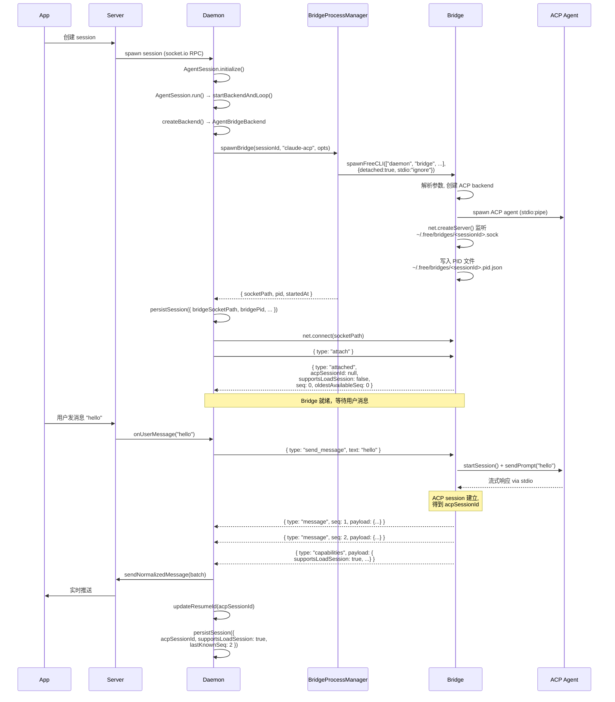
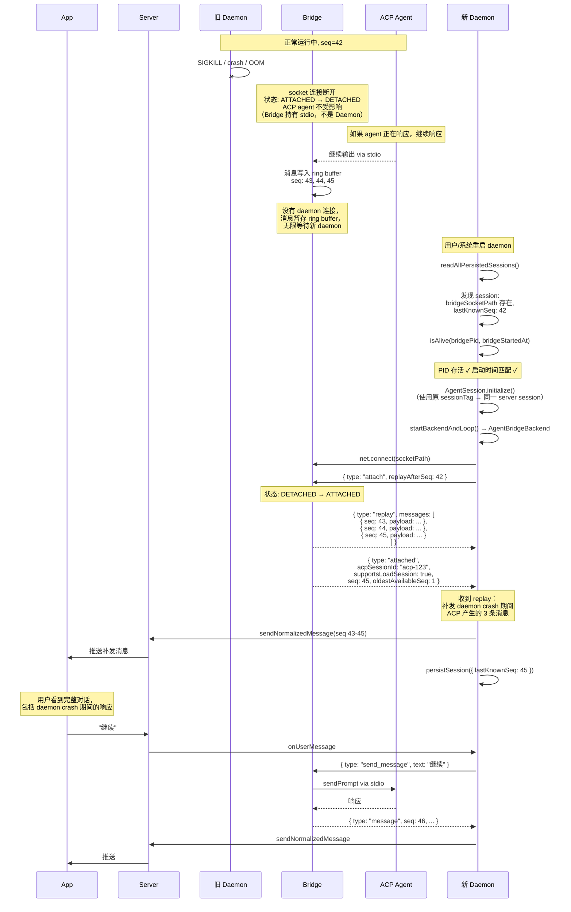
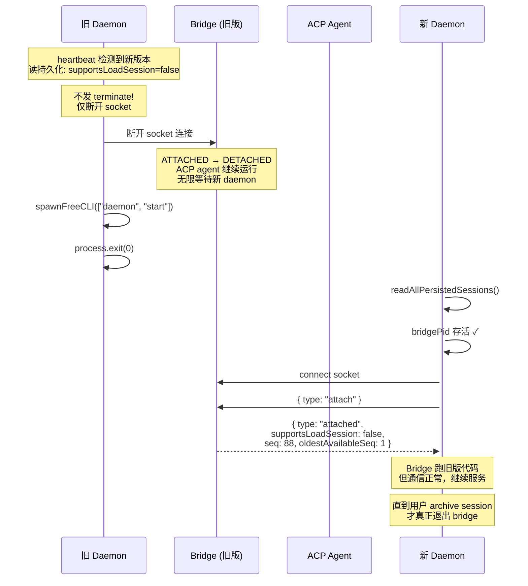
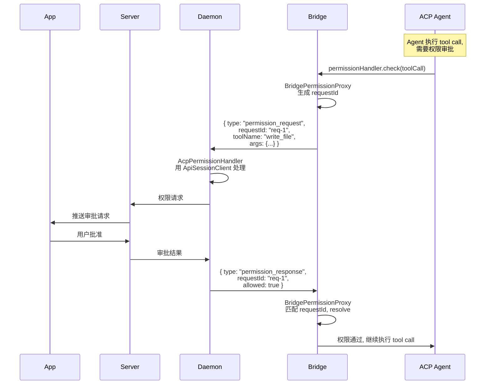

# RFC-004: Agent Socket Bridge Architecture

> ACP Agent 进程跨 Daemon 重启存活 + Re-attach + 版本热更新

## 1. 问题陈述

当前 ACP agent 进程（claude-acp, codex-acp, gemini, opencode）通过 **stdio pipe** 与 daemon 通信。daemon 是父进程，pipe 的生命周期 = daemon 的生命周期。daemon 一旦重启（版本更新、crash、手动重启），所有 ACP agent 进程立即失去通信信道并退出。

现有的 `loadSession()` 恢复机制（RFC-004 前置工作，已实现）可以在 daemon 重启后重建新 agent 进程并恢复对话上下文，但：

- 需要 ACP agent 支持 `loadSession` 能力（不是所有 agent 都支持）
- 即使支持，也存在**数据窗口**：daemon crash 时 agent 正在处理的响应会丢失
- 重建 agent 进程有冷启动开销（数秒级）

## 2. 目标

1. ACP agent 进程在 daemon 重启后**继续存活**，不丢失任何状态
2. 新 daemon 能**无缝 re-attach** 到存活的 agent 进程
3. daemon crash 期间 agent 产生的消息**零丢失**（通过 ring buffer replay）
4. 版本更新时，支持 `loadSession` 的 agent 可以**安全重启 bridge**，使用最新代码
5. 不支持 `loadSession` 的 agent，bridge 永不主动退出，保障对话不丢失

## 3. 架构总览

### 3.1 当前架构

```
App <-> Server <-> Daemon <-> (stdio pipe) <-> ACP Agent
                     |
                     +--- daemon 死 -> pipe 断 -> agent 死
```

### 3.2 目标架构

所有 ACP agent 通过 **Bridge 进程** 与 daemon 通信（不存在"非 bridge"模式）：

```
App <-> Server <-> Daemon <-> (Unix socket) <-> Bridge <-> (stdio pipe) <-> ACP Agent
                     |                            |
                     +--- daemon 死                +--- Bridge 继续持有 agent
                     |                            |    agent 不受影响
                     +--- 新 daemon 启动           +--- 等待新 daemon 连接
                     |                            |
                     +--- connect socket --------→+--- re-attach 成功
```

关键属性：

- Bridge 进程 `detached: true`，独立进程组
- Bridge 持有 ACP agent 的 stdio pipe
- Daemon 通过 **Unix domain socket** 连接 Bridge（socket 路径固定，可跨进程复用）
- Bridge 维护 **ring buffer**（上限 10000 条），daemon crash 期间不丢消息
- 非 ACP agent（`claude` native, `codex` native）不受影响，走原有 PTY/SDK + `--resume` 路径

### 3.3 进程分层

```
Daemon 进程                          Bridge 进程
─────────────                        ─────────────
AgentSession                         AgentSocketBridge
  └─ AgentBridgeBackend                └─ ClaudeAcpBackend (extends DiscoveredAcpBackendBase)
       └─ BridgeConnection ←────→          └─ ACP agent (stdio)
          (Unix socket client)              └─ Unix socket server
                                            └─ BridgePermissionProxy
```

- **AgentBridgeBackend**（daemon 进程）：实现 `AgentBackend` 接口，通过 socket 与 bridge 通信。不碰 ACP 协议，不管 stdio。
- **DiscoveredAcpBackendBase 子类**（bridge 进程）：管 ACP agent 的 stdio、message 映射、capability 管理。不碰 server，不碰 session。
- **BridgePermissionProxy**（bridge 进程）：代理权限请求，通过 socket 转发给 daemon，daemon 用 `ApiSessionClient` 完成审批。

## 4. 核心组件

### 4.1 Bridge 进程（新增）

**入口**：`free daemon bridge --session-id <id> --agent-type <type> --cwd <dir> ...`

**职责**：

- 创建对应的 ACP backend（调用 `createClaudeAcpBackend` 等工厂）
- 监听 Unix socket（`~/.free/bridges/<sessionId>.sock`）
- 桥接 daemon socket 消息 ↔ ACP agent stdio
- 维护 ring buffer（上限 10000 条 NormalizedMessage，防御 OOM；实际单 turn 不可能超此上限）
- 单连接模式：同时只接受一个 daemon 连接
- daemon 断开后保持 ACP agent 存活，无限等待重连
- 收到 `terminate` 后 graceful shutdown

**状态机**：

```
  spawn
    |
    v
 STARTING ──→ LISTENING ──→ ATTACHED ←──→ DETACHED
                                |               |
                                v               v
                           TERMINATING     (无限等待重连)
                                |
                                v
                             EXITED
```

Bridge 不主动退出。DETACHED 状态永久等待新 daemon 连接。清理只有两条路径：

1. Daemon 发 `terminate`（用户 archive session）
2. `doctor` 命令手动清理残留 bridge

### 4.2 Bridge 协议

Wire format：newline-delimited JSON over Unix socket。

```typescript
// ─── Daemon → Bridge ───────────────────────────────────────

type DaemonToBridgeMessage =
  | { type: 'attach'; replayAfterSeq?: number }
  | { type: 'send_message'; text: string; permissionMode?: string }
  | { type: 'abort' }
  | { type: 'set_model'; modelId: string }
  | { type: 'set_mode'; modeId: string }
  | { type: 'set_config'; optionId: string; value: string }
  | { type: 'run_command'; commandId: string }
  | { type: 'permission_response'; requestId: string; allowed: boolean }
  | { type: 'terminate' };

// ─── Bridge → Daemon ───────────────────────────────────────

type BridgeToDaemonMessage =
  | {
      type: 'attached';
      acpSessionId: string | null;
      supportsLoadSession: boolean;
      seq: number; // 当前最大 seq
      oldestAvailableSeq: number; // ring buffer 中最早的 seq（防御性校验）
    }
  | { type: 'replay'; messages: Array<{ seq: number; payload: NormalizedMessage }> }
  | { type: 'message'; seq: number; payload: NormalizedMessage }
  | { type: 'capabilities'; payload: SessionCapabilities }
  | { type: 'permission_request'; requestId: string; toolName: string; args: unknown }
  | { type: 'agent_exited'; exitInfo: BackendExitInfo }
  | { type: 'terminated' };
```

**权限转发说明**：

ACP agent 发起 tool call 时需要权限审批。当前 `AcpPermissionHandler` 通过 `ApiSessionClient` 与 server 交互完成审批。Bridge 进程没有 `ApiSessionClient`，因此使用代理转发：

```
ACP agent 请求权限
  → Bridge 内 BridgePermissionProxy
  → socket: { type: 'permission_request', requestId, toolName, args }
  → Daemon 用 ApiSessionClient → Server → App → 审批结果
  → socket: { type: 'permission_response', requestId, allowed }
  → BridgePermissionProxy → ACP agent 继续执行
```

本质是转发，但因为权限是 request-response 模式（ACP agent 阻塞等待结果），需要 `requestId` 配对请求和响应。

### 4.3 AgentBridgeBackend（新增）

实现 `AgentBackend` 接口，是 daemon 进程中 ACP agent 的唯一 backend 实现：

- `start(opts)` → 检查是否存在活跃 bridge socket → re-attach 或 spawn 新 bridge
- `sendMessage()` → 发 `send_message` 到 socket
- `abort()` → 发 `abort`
- `stop()` → 仅断开 socket（bridge 继续存活）
- `terminate()` → 发 `terminate`（正常 session 结束时）

`DiscoveredAcpBackendBase` 及其子类（`ClaudeAcpBackend`, `GeminiBackend` 等）只在 bridge 进程内部使用，daemon 进程不再 import 它们。

### 4.4 BridgeProcessManager（新增）

Bridge 进程的启动和发现：

- `spawnBridge(sessionId, agentType, opts)` → `spawnFreeCLI(['daemon', 'bridge', ...], { detached: true, stdio: 'ignore' })` → 返回 `{ socketPath, pid, startedAt }`
- `isAlive(pid, startedAt)` → PID 存活 + 启动时间匹配（防 PID 复用）
- `connectToBridge(socketPath)` → 创建 Unix socket 连接
- `cleanupStale()` → 清理已死亡的 bridge socket 文件和 PID 文件

**Bridge 就绪信号**：bridge 进程先 listen socket，再写 PID 文件。daemon 等 PID 文件出现后再 connect，避免 connect 时 socket 尚未 listen。

文件布局：

```
~/.free/bridges/
  ├── <sessionId>.sock       # Unix domain socket
  ├── <sessionId>.pid.json   # { pid, startedAt, agentType, cwd }
  └── ...
```

## 5. 数据流

### 5.1 正常消息流

```
User input (App)
  → Server (socket.io)
  → Daemon (onUserMessage)
  → AgentBridgeBackend.sendMessage()
  → Unix socket: { type: 'send_message', text: '...' }
  → Bridge
  → ACP agent (sendPrompt via stdio)
  → ACP agent 响应 (stdio)
  → Bridge (mapRawMessage → NormalizedMessage, seq++)
  → Bridge ring buffer 记录
  → Unix socket: { type: 'message', seq: N, payload: {...} }
  → Daemon (AgentBridgeBackend.output.push)
  → AgentSession.pipeBackendOutput()
  → sendNormalizedMessage → Server → App
```

### 5.2 `lastKnownSeq` 持久化策略

daemon 收到 bridge 的消息时更新内存中的 `lastKnownSeq`，但不每条消息都写磁盘：

- 内存中实时更新
- 每 10 秒或每 50 条消息批量持久化一次
- `stopBackend()` / daemon 优雅退出时强制写一次
- Crash 场景下最多丢 10 秒的 seq 跟踪 → bridge replay 多发几条重复消息 → daemon 侧去重

### 5.3 持久化字段扩展

```typescript
interface PersistedSession {
  // ─── 现有字段 ───
  sessionId: string;
  sessionTag: string;
  agentType: AgentType;
  cwd: string;
  resumeSessionId?: string; // ACP session ID for loadSession fallback
  permissionMode?: PermissionMode;
  model?: string;
  mode?: string;
  startingMode?: 'local' | 'remote';
  startedBy: SessionInitiator;
  env?: Record<string, string>;
  createdAt: number;
  daemonInstanceId: string;

  // ─── Bridge 新增字段 ───
  bridgeSocketPath?: string; // Unix socket 路径
  bridgePid?: number; // Bridge 进程 PID
  bridgeStartedAt?: number; // Bridge 启动时间（防 PID 复用）
  supportsLoadSession?: boolean; // Agent 是否支持 loadSession
  lastKnownSeq?: number; // Daemon 最后确认的 seq（用于 replay）
}
```

## 6. Ring Buffer 数据完整性

ring buffer 上限 10000 条。是否可能溢出？

- Daemon 不在时，没人发 `send_message`，agent 不会收到新 prompt
- Agent 最多完成 crash 前**正在进行的 turn** 的输出
- 单 turn 输出通常几十到几百条 NormalizedMessage，远远不到 10000

**结论：实际场景下不会溢出。** 10000 上限纯粹是 OOM 防御，每个 bridge 是独立进程，即使一个 bridge OOM 也不影响其他 bridge 或 daemon。

`attached` 消息中的 `oldestAvailableSeq` 用于防御性校验：daemon 检查 `replayAfterSeq >= oldestAvailableSeq` 确认数据完整。正常情况下恒成立。

## 7. 时序图

### 7.1 首次启动



### 7.2 Daemon crash → Bridge 存活 → 新 Daemon re-attach



### 7.3 版本更新 + agent 支持 loadSession → 安全重启 Bridge

```mermaid
sequenceDiagram
    participant D1 as 旧 Daemon
    participant Bridge1 as Bridge (旧版)
    participant ACP1 as ACP Agent (旧)
    participant D2 as 新 Daemon
    participant Bridge2 as Bridge (新版)
    participant ACP2 as ACP Agent (新)

    Note over D1: heartbeat 检测到新版本<br/>读持久化: supportsLoadSession=true

    D1->>Bridge1: { type: "terminate" }
    Bridge1->>ACP1: cancel() + dispose()
    ACP1-->>Bridge1: 退出
    deactivate ACP1
    Bridge1->>Bridge1: 删除 socket 文件 + PID 文件
    Bridge1-->>D1: { type: "terminated" }
    deactivate Bridge1

    D1->>D1: spawnFreeCLI(["daemon", "start"])
    D1->>D1: process.exit(0)

    activate D2
    D2->>D2: readAllPersistedSessions()
    D2->>D2: 发现 session:<br/>bridgePid 已死,<br/>acpSessionId: "acp-123",<br/>supportsLoadSession: true

    D2->>D2: AgentSession.initialize()
    D2->>D2: startBackendAndLoop() → AgentBridgeBackend

    Note over D2: Bridge 不存在,<br/>但有 acpSessionId → spawn 新 bridge + loadSession

    D2->>Bridge2: spawnFreeCLI(["daemon", "bridge",<br/>"--resume-acp-session", "acp-123", ...])
    activate Bridge2
    Bridge2->>ACP2: spawn 新 ACP agent
    activate ACP2
    Bridge2->>ACP2: loadSession("acp-123")
    ACP2-->>Bridge2: 历史回放, session 恢复
    Bridge2->>Bridge2: listen socket

    D2->>Bridge2: connect + attach
    Bridge2-->>D2: { type: "attached",<br/>acpSessionId: "acp-123",<br/>supportsLoadSession: true,<br/>seq: 0, oldestAvailableSeq: 0 }

    Note over D2,ACP2: 全部使用新版代码<br/>对话通过 loadSession 无缝恢复
```

### 7.4 版本更新 + agent 不支持 loadSession → 保留旧 Bridge



### 7.5 用户 archive session → 正常终止

```mermaid
sequenceDiagram
    participant App
    participant Server
    participant Daemon
    participant Bridge
    participant ACP as ACP Agent

    App->>Server: archive session
    Server->>Daemon: RPC kill-session

    Daemon->>Bridge: { type: "terminate" }
    Bridge->>ACP: cancel() + dispose()
    ACP-->>Bridge: 退出
    deactivate ACP
    Bridge->>Bridge: 删除 .sock + .pid.json
    Bridge-->>Daemon: { type: "terminated" }
    Bridge->>Bridge: process.exit(0)
    deactivate Bridge

    Daemon->>Daemon: erasePersistedSession(sessionId)
    Daemon->>Daemon: AgentSession.shutdown()
    Daemon->>Server: updateState({ archived })
    Server->>App: session archived
```

### 7.6 权限审批转发



## 8. 决策矩阵

### 8.1 Daemon 重启时的决策

```
Daemon 即将退出 (版本更新 / 手动 stop / crash):

  逐 session 判断:

    不是 ACP agent (claude native / codex native)?
    └─ stopBackend() → 走 --resume 恢复

    ACP agent + 版本更新 + supportsLoadSession = true?
    └─ terminate bridge → 新 daemon 重建 (新版代码 + loadSession)

    ACP agent + 版本更新 + supportsLoadSession = false?
    └─ detach (不 terminate) → 新 daemon re-attach 到旧 bridge (旧版代码继续服务)

    ACP agent + 非版本更新 (手动 stop / crash)?
    └─ detach → 新 daemon re-attach
```

### 8.2 新 Daemon Recovery 时的决策

```
新 Daemon 启动, 读取 persisted session:

  有 bridgeSocketPath?
  ├─ YES → isAlive(bridgePid, bridgeStartedAt)?
  │         ├─ YES → connect socket, re-attach
  │         └─ NO (bridge 已死) → 有 acpSessionId + supportsLoadSession?
  │                               ├─ YES → spawn 新 bridge + loadSession
  │                               └─ NO → spawn 新 bridge + startSession (新对话)
  └─ NO (非 ACP, 如 claude native) → 现有逻辑 (--resume)
```

## 9. 文件清单

### 9.1 新增文件

| 文件                                     | 职责                                                                                      |
| ---------------------------------------- | ----------------------------------------------------------------------------------------- |
| `daemon/bridge/AgentSocketBridge.ts`     | Bridge 进程主逻辑（状态机 + socket 服务 + ring buffer + ACP 管理）                        |
| `daemon/bridge/protocol.ts`              | Bridge 协议类型定义（DaemonToBridgeMessage / BridgeToDaemonMessage）                      |
| `daemon/bridge/BridgeProcessManager.ts`  | Bridge 进程启动/发现/清理                                                                 |
| `daemon/bridge/BridgeConnection.ts`      | Daemon 侧 socket 连接封装（connect / send / onMessage / replay）                          |
| `daemon/bridge/BridgePermissionProxy.ts` | Bridge 侧权限代理（转发 permission request/response）                                     |
| `backends/acp/AgentBridgeBackend.ts`     | 实现 AgentBackend 接口，通过 Bridge socket 通信（daemon 进程中 ACP agent 的唯一 backend） |

### 9.2 修改文件

| 文件                                    | 改动                                                                       |
| --------------------------------------- | -------------------------------------------------------------------------- |
| `daemon/sessions/sessionPersistence.ts` | PersistedSession 新增 bridge\* 字段                                        |
| `daemon/sessions/AgentSession.ts`       | stopBackend/shutdown 区分 bridge 模式；新增 terminateBridge / detachBridge |
| `daemon/sessions/ClaudeAcpSession.ts`   | createBackend() 返回 AgentBridgeBackend                                    |
| `daemon/sessions/GeminiSession.ts`      | createBackend() 返回 AgentBridgeBackend                                    |
| `daemon/sessions/OpenCodeSession.ts`    | createBackend() 返回 AgentBridgeBackend                                    |
| `daemon/sessions/CodexAcpSession.ts`    | createBackend() 返回 AgentBridgeBackend                                    |
| `daemon/run.ts`                         | recovery loop 新增 bridge re-attach 路径；版本更新逻辑新增决策分支         |
| `index.ts`                              | 注册 `daemon bridge` 子命令                                                |
| `daemon/sessions/AgentBackend.ts`       | AgentStartOpts 新增 bridgeSocketPath 等字段                                |

### 9.3 无需修改

| 文件                                             | 原因                                      |
| ------------------------------------------------ | ----------------------------------------- |
| `daemon/ipc/IPCServer.ts`                        | daemon ↔ CLI 通道，与 bridge 无关         |
| `daemon/ipc/IPCClient.ts`                        | 同上                                      |
| `daemon/ipc/protocol.ts`                         | 同上                                      |
| `server/*`                                       | Server 侧无感知                           |
| `app/*`                                          | App 侧无感知                              |
| `packages/core/src/implementations/agent/acp.ts` | ACP SDK 不改动，bridge 内部调用           |
| `persistence.ts`                                 | 无需新增配置（bridge 是唯一模式，无开关） |

## 10. 实现阶段

### Phase 1: 基础设施

1. **PersistedSession 扩展**：bridge\* 字段
2. **Bridge 协议定义**：`daemon/bridge/protocol.ts`（含 permission 消息）
3. **BridgeProcessManager**：spawn, isAlive, connect, cleanup, 就绪信号（PID 文件约定）

### Phase 2: Bridge 进程

4. **AgentSocketBridge**：状态机 + socket 服务 + ring buffer（10000 条上限）
5. **BridgePermissionProxy**：权限请求转发代理
6. **`daemon bridge` CLI 入口**：参数解析 → AgentSocketBridge.run()
7. **ACP backend 集成**：bridge 内部直接实例化现有 `DiscoveredAcpBackendBase` 子类（`ClaudeAcpBackend` 等），桥接其 `output`/`capabilities` 流到 socket

### Phase 3: Daemon 侧集成

8. **BridgeConnection**：Daemon 侧 socket 连接封装
9. **AgentBridgeBackend**：实现 AgentBackend 接口
10. **Session 子类改造**：`ClaudeAcpSession` / `GeminiSession` / `OpenCodeSession` / `CodexAcpSession` 的 `createBackend()` 返回 `AgentBridgeBackend`
11. **AgentSession 改造**：stopBackend / shutdown 支持 bridge 的 detach / terminate 语义

### Phase 4: Recovery 和版本更新

12. **run.ts recovery**：bridge re-attach 路径（isAlive → connect → replay）
13. **run.ts 版本更新**：terminate (supportsLoadSession) vs detach (不支持) 决策
14. **lastKnownSeq 批量持久化**：内存实时更新，定期写磁盘，退出时强制写

### Phase 5: 测试和清理

15. **单元测试**：Bridge 协议、BridgeProcessManager、AgentBridgeBackend、BridgePermissionProxy
16. **集成测试**：daemon restart + re-attach + replay、version update + terminate + loadSession
17. **doctor 命令扩展**：发现并清理残留 bridge 进程

## 11. 边界情况

| 场景                                                    | 处理                                                                                                          |
| ------------------------------------------------------- | ------------------------------------------------------------------------------------------------------------- |
| Bridge spawn 后 daemon 立即 crash                       | Bridge 进入 DETACHED，无限等待新 daemon re-attach                                                             |
| Bridge 自身 crash（极少见）                             | 新 daemon 通过 isAlive 检测到，走 loadSession / startSession fallback                                         |
| PID 复用（旧 bridge PID 被新进程占用）                  | bridgeStartedAt 双验证：PID 存活 + 启动时间匹配                                                               |
| Bridge socket 文件残留（bridge 已死但 .sock 未删）      | BridgeProcessManager.cleanupStale() 在 daemon 启动时清理                                                      |
| 两个 daemon 同时 connect 同一个 bridge                  | Bridge 单连接模式：新连接 kick 掉旧连接                                                                       |
| Ring buffer 溢出（理论上不可能）                        | 上限 10000 条；无 daemon 时 agent 最多完成一个 turn 的输出（远小于 10000）；`oldestAvailableSeq` 做防御性校验 |
| ACP agent 支持 loadSession 但 loadSession 调用失败      | 已有 fallback：loadSession 失败 → startSession 新建（实现于 RFC-004 前置工作）                                |
| Bridge spawn 竞态（daemon connect 时 socket 未 listen） | PID 文件约定：bridge 先 listen socket，再写 PID 文件；daemon 等 PID 文件出现后再 connect                      |
| Daemon 断开期间 ACP agent 请求权限                      | 无 daemon 连接 → BridgePermissionProxy 无法转发 → 权限请求超时/拒绝 → agent 报错但不崩溃                      |

## 12. 与现有机制的关系

| 机制                       | 角色                     | Bridge 是否改变它                           |
| -------------------------- | ------------------------ | ------------------------------------------- |
| `loadSession()` (已实现)   | Bridge 死亡时的 fallback | 否，仍然作为兜底                            |
| `--resume` (Claude native) | Claude 非 ACP 的恢复路径 | 否，不受影响                                |
| `sessionPersistence`       | 持久化框架               | 扩展字段，不改机制                          |
| `IPCServer/Client`         | Daemon ↔ CLI 通道        | 不涉及                                      |
| `setupOfflineReconnection` | Daemon ↔ Server 断线重连 | 不涉及                                      |
| `outbox`                   | Daemon → Server 消息缓冲 | 不涉及                                      |
| `onReconnected` (App)      | App ↔ Server 断线重连    | 不涉及                                      |
| `AcpPermissionHandler`     | 权限审批                 | 仍在 daemon 侧运行，bridge 通过 socket 转发 |
