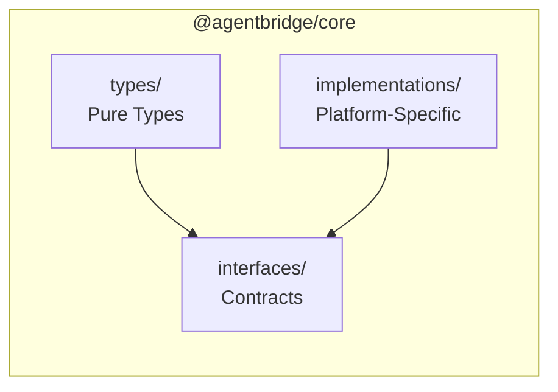

# @agentbridge/core

[](https://www.npmjs.com/package/@agentbridge/core)
[](https://opensource.org/licenses/MIT)

Core SDK for AgentBridge — Type definitions, interface contracts, and cross-platform implementations for building AI agent control systems.

## Architecture Philosophy

**Interfaces define contracts, implementations provide capabilities, factory patterns enable dependency inversion.**



## Installation

```bash
npm install @agentbridge/core
# or
pnpm add @agentbridge/core
```

## Platform Support

| Capability | CLI (Node.js) | Server (Node.js) | Server (Edge) | App (React Native) |
|------------|:-------------:|:----------------:|:-------------:|:------------------:|
| **Crypto** | tweetnacl + AES-256-GCM | privacy-kit/KeyTree | Web Crypto | libsodium |
| **Storage** | fs (JSON + file locks) | Prisma + PostgreSQL | KV | MMKV |
| **SecureStorage** | Encrypted files | - | KV (encrypted) | Expo SecureStore |
| **Http** | axios | axios | fetch | axios |
| **WebSocket** | socket.io-client | socket.io server | Durable Objects | socket.io-client |
| **Process** | spawn + node-pty | - | ❌ | ❌ |
| **AgentBackend** | ✅ | ❌ | ❌ | ❌ |

## Core Interfaces

### AgentBackend

Unified interface for different AI agent backends:

```typescript
import { AgentBackend, AgentMessage } from '@agentbridge/core';

type SessionId = string;
type ToolCallId = string;

// Agent message types
type AgentMessage =
  | { type: 'model-output'; textDelta?: string; fullText?: string }
  | { type: 'status'; status: 'starting' | 'running' | 'idle' | 'stopped' | 'error'; detail?: string }
  | { type: 'tool-call'; toolName: string; args: Record<string, unknown>; callId: ToolCallId }
  | { type: 'tool-result'; toolName: string; result: unknown; callId: ToolCallId }
  | { type: 'permission-request'; id: string; reason: string; payload: unknown }
  | { type: 'permission-response'; id: string; approved: boolean }
  | { type: 'fs-edit'; description: string; diff?: string; path?: string }
  | { type: 'terminal-output'; data: string }
  | { type: 'event'; name: string; payload: unknown };

interface AgentBackend {
  startSession(initialPrompt?: string): Promise<{ sessionId: SessionId }>;
  sendPrompt(sessionId: SessionId, prompt: string): Promise<void>;
  cancel(sessionId: SessionId): Promise<void>;
  onMessage(handler: (msg: AgentMessage) => void): void;
  offMessage?(handler: (msg: AgentMessage) => void): void;
  respondToPermission?(requestId: string, approved: boolean): Promise<void>;
  waitForResponseComplete?(timeoutMs?: number): Promise<void>;
  dispose(): Promise<void>;
}
```

### TransportHandler

Handle agent-specific behaviors for the ACP protocol:

```typescript
interface TransportHandler {
  readonly agentName: string;

  // Timeout configuration
  getInitTimeout(): number;  // Gemini: 120s, Codex: 30s, Claude: 10s
  getIdleTimeout?(): number;
  getToolCallTimeout?(toolCallId: string, toolKind?: string): number;

  // Output processing
  filterStdoutLine?(line: string): string | null;
  handleStderr?(text: string, context: StderrContext): StderrResult;

  // Tool identification
  getToolPatterns(): ToolPattern[];
  isInvestigationTool?(toolCallId: string, toolKind?: string): boolean;
  extractToolNameFromId?(toolCallId: string): string | null;
}
```

### ICrypto

Encryption interfaces supporting both legacy (tweetnacl) and modern (AES-256-GCM) modes:

```typescript
interface EncryptedData {
  ciphertext: Uint8Array;
  nonce: Uint8Array;  // 12 bytes for GCM, 24 bytes for secretbox
  tag?: Uint8Array;   // 16 bytes auth tag for GCM
}

interface ICrypto {
  getRandomBytes(size: number): Uint8Array;

  // Legacy mode (tweetnacl)
  secretbox(plaintext: Uint8Array, nonce: Uint8Array, key: Uint8Array): Uint8Array;
  secretboxOpen(ciphertext: Uint8Array, nonce: Uint8Array, key: Uint8Array): Uint8Array | null;
  boxKeyPair(): { publicKey: Uint8Array; secretKey: Uint8Array };
  box(plaintext: Uint8Array, nonce: Uint8Array, peerPublicKey: Uint8Array, secretKey: Uint8Array): Uint8Array;
  boxOpen(ciphertext: Uint8Array, nonce: Uint8Array, peerPublicKey: Uint8Array, secretKey: Uint8Array): Uint8Array | null;
  boxSeal(plaintext: Uint8Array, peerPublicKey: Uint8Array): Uint8Array;
  boxSealOpen(ciphertext: Uint8Array, publicKey: Uint8Array, secretKey: Uint8Array): Uint8Array | null;

  // DataKey mode (AES-256-GCM)
  encryptAesGcm(plaintext: Uint8Array, key: Uint8Array): EncryptedData;
  decryptAesGcm(encrypted: EncryptedData, key: Uint8Array): Uint8Array | null;

  // Ed25519 signatures
  signKeyPairFromSeed(seed: Uint8Array): { publicKey: Uint8Array; secretKey: Uint8Array };
  signDetached(message: Uint8Array, secretKey: Uint8Array): Uint8Array;
  verifyDetached(message: Uint8Array, signature: Uint8Array, publicKey: Uint8Array): boolean;

  // Auth challenge
  authChallenge(secret: Uint8Array): { challenge: Uint8Array; publicKey: Uint8Array; signature: Uint8Array };
}
```

**Implementations:**
- `crypto-node` — Node.js crypto (AES-256-GCM) + tweetnacl
- `crypto-rn` — libsodium-wrappers for React Native
- `crypto-edge` — Web Crypto API

### IStorage

Key-value storage interface:

```typescript
interface IStorage {
  get(key: string): Promise<string | null>;
  set(key: string, value: string): Promise<void>;
  delete(key: string): Promise<void>;
  exists(key: string): Promise<boolean>;
  clear(): Promise<void>;
}
```

**Implementations:**
- `storage-fs` — Node.js filesystem with file locks
- `storage-mmkv` — React Native MMKV
- `storage-kv` — Cloudflare KV

### ISecureStorage

Encrypted storage interface:

```typescript
interface ISecureStorage {
  getItem(key: string): Promise<string | null>;
  setItem(key: string, value: string): Promise<void>;
  deleteItem(key: string): Promise<void>;
}
```

**Implementations:**
- `secure-storage-fs` — Encrypted file storage (CLI)
- `secure-storage-expo` — Expo SecureStore (App)
- `secure-storage-kv` — Encrypted KV (Edge)

### IHttpClient

HTTP client abstraction:

```typescript
interface IHttpClient {
  get<T>(url: string, config?: RequestConfig): Promise<T>;
  post<T>(url: string, body?: unknown, config?: RequestConfig): Promise<T>;
  put<T>(url: string, body?: unknown, config?: RequestConfig): Promise<T>;
  delete<T>(url: string, config?: RequestConfig): Promise<T>;
}
```

**Implementations:** `http-axios`, `http-fetch`

### IWebSocketClient

WebSocket client interface:

```typescript
interface IWebSocketClient {
  connect(url: string, options?: { auth?: Record<string, string> }): Promise<void>;
  disconnect(): void;
  emit(event: string, data: unknown): void;
  on(event: string, handler: (data: unknown) => void): void;
  off(event: string, handler?: (data: unknown) => void): void;
  emitWithAck?(event: string, data: unknown, timeout?: number): Promise<unknown>;
}
```

**Implementations:** `ws-socketio-client`, `ws-native`

### IWebSocketServer

WebSocket server interface:

```typescript
interface ISocket {
  id: string;
  emit(event: string, data: unknown): void;
  on(event: string, handler: (data: unknown) => void): void;
  timeout(ms: number): { emitWithAck(event: string, data: unknown): Promise<unknown> };
}

interface IWebSocketServer {
  attach(httpServer: unknown): void;
  onConnection(handler: (socket: ISocket) => void): void;
  to(room: string): { emit(event: string, data: unknown): void };
}
```

**Implementations:** `ws-server-socketio`, `ws-server-durable`

### IProcess

Process management (CLI only):

```typescript
interface IProcess {
  pid: number;
  kill(signal?: string): void;
  wait(): Promise<{ code: number }>;
  stdout: AsyncIterable<string>;
  stderr: AsyncIterable<string>;
  stdin: { write(data: string): void };
}

interface IProcessManager {
  spawn(command: string, args: string[], options?: { cwd?: string; env?: Record<string, string> }): IProcess;
  exec(command: string): Promise<{ stdout: string; stderr: string; code: number }>;
}
```

**Implementations:** `process-node`, `process-pty`

## Communication Protocol

### WebSocket Events

```typescript
// Persistent events
type UpdateEvent =
  | { type: 'new-message'; sessionId: string; message: Message }
  | { type: 'new-session'; sessionId: string; metadata: SessionMetadata; dataEncryptionKey: Uint8Array }
  | { type: 'update-session'; sessionId: string; metadata?: Partial<SessionMetadata> }
  | { type: 'new-machine'; machineId: string; metadata: MachineMetadata }
  | { type: 'update-machine'; machineId: string; metadata?: Partial<MachineMetadata> }
  | { type: 'delete-session'; sessionId: string }
  | { type: 'kv-batch-update'; changes: Array<{ key: string; value: unknown; version: number }> };

// Ephemeral events
type EphemeralEvent =
  | { type: 'activity'; id: string; active: boolean; thinking?: boolean }
  | { type: 'usage'; id: string; tokens: number; cost: number }
  | { type: 'machine-status'; machineId: string; online: boolean };
```

### RPC Mechanism

```typescript
// Register RPC handler
socket.emit('rpc-register', { method: 'permission-response' });

// Call RPC
const result = await socket.emitWithAck('rpc-call', {
  method: 'permission-response',
  params: { requestId: 'xxx', approved: true },
});
```

## Telemetry

Unified logging system with trace correlation:

```typescript
import { Logger, initTelemetry, FileSink, RemoteSink } from '@agentbridge/core/telemetry';

const logger = new Logger('my-component');

logger.debug('Debug message', { key: 'value' });  // Local only
logger.info('Info message', { key: 'value' });    // Sent to remote
logger.error('Error message', new Error('details'), { context: 'data' });
```

## Directory Structure

```
packages/core/
├── src/
│   ├── types/
│   │   ├── session.ts
│   │   ├── message.ts
│   │   ├── machine.ts
│   │   ├── agent.ts
│   │   └── index.ts
│   │
│   ├── interfaces/
│   │   ├── agent.ts          # AgentBackend + AgentMessage
│   │   ├── transport.ts      # TransportHandler (ACP)
│   │   ├── crypto.ts
│   │   ├── storage.ts
│   │   ├── http.ts
│   │   ├── websocket.ts
│   │   ├── process.ts
│   │   ├── events.ts
│   │   └── index.ts
│   │
│   ├── implementations/
│   │   ├── agent/
│   │   │   ├── acp.ts        # ACP protocol backend
│   │   │   └── index.ts
│   │   ├── crypto/
│   │   ├── storage/
│   │   ├── secure-storage/
│   │   ├── http/
│   │   ├── websocket/
│   │   ├── process/
│   │   └── index.ts
│   │
│   ├── telemetry/            # Unified logging system
│   │   ├── logger.ts
│   │   ├── collector.ts
│   │   ├── context.ts
│   │   └── sinks/
│   │
│   └── utils/
│       ├── encoding.ts
│       └── index.ts
│
├── package.json
└── tsconfig.json
```

## License

MIT
